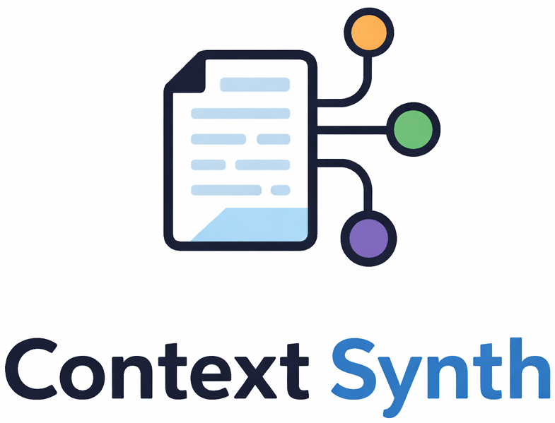

<div align="center">
  
</div>

---

## Status

**v0.1.0** — first end-to-end release. Context Synth compiles diverse sources (markdown documents, MP3 audio files) into governed, machine-readable context artifacts (JSON), then resolves a capability graph over that artifact to produce dynamic output. Llama (via ollama) is the default LLM provider. The artifact format is unstable and will change.

For a detailed account of what's working, what isn't, and what's deferred, see [STATUS.md](STATUS.md).

---

Context Synth is a context-driven orchestration framework for governed AI reasoning. It compiles knowledge from configured sources into a bounded, traceable context artifact, then uses that artifact to construct and resolve a dependency graph of external capabilities into dynamic output.

```
Phase 1: Context Compilation
Sources → Snap → Extract → Rank → Assemble → Verify → Context Artifact (JSON)

Phase 2: Capability Resolution
Context Artifact → Graph Construction → Dependency Resolution → Projection
```

For details on the inner workings, see the [Project Spec](docs/PROJECT_SPEC.md) and [System Design](docs/SYSTEM_DESIGN.md).

### What v0.1.0 supports

- **Markdown and MP3 audio** source types
- Per-source weight declaration (markdown supports globs)
- Global token budget with strict enforcement
- User-defined section structure with LLM-backed classification
- Deterministic fallback mode with no LLM required
- Machine-readable JSON artifact with full governance metadata (provenance, weights, hashes, omissions)
- Capability graph construction and topological resolution
- LLM and subprocess executor mechanisms
- Adapter interface for output projection
- Llama as the default LLM provider (local inference via ollama)
- [DJ-V](examples/dj-v/) — first example application (documents + audio → governed artifact → capability graph → generative music)

### Long-term direction

Context Synth is intended to become an infrastructure layer for orchestrating system capabilities over governed context — ingesting from repositories, MCP servers, and other external sources; supporting stable artifact versioning, diffing, and drift detection; richer dependency semantics and reactive graph resolution; and integrating into CI pipelines.

## What It Is Not

- Not a wiki or documentation system
- Not a RAG layer
- Not an agent
- Not a capability runtime — it orchestrates capabilities that external systems provide
- Not a prompt manager or model provider

## Installation

Requires Go 1.26+.

```bash
go install github.com/anthonymartinovic/context-synth/cmd/cs@latest
```

Or build from source:

```bash
git clone https://github.com/anthonymartinovic/context-synth.git
cd context-synth
go build -o cs ./cmd/cs/
```

## Quick Start

```bash
# Generate a starter config
cs init

# Edit contextsynth.yml to declare your sources, weights, and budget

# Preview resolved sources
cs snap

# Produce a context artifact (deterministic, no LLM)
cs synth --no-llm

# Produce a context artifact with LLM-backed extraction (requires ollama)
cs synth

# Resolve a capability graph over the artifact
cs run --artifact artifact.json --capabilities capabilities.json --adapter "your-adapter-cmd"
```

LLM-backed extraction requires ollama running locally with a Llama model:

```bash
brew install ollama
ollama serve &
ollama pull llama3.1:8b
```

## Usage

### `cs init`

Creates a starter `contextsynth.yml` in the current directory.

### `cs snap`

Resolves sources and prints a snapshot table showing each source's weight, token count, and content hash.

```
Source                                   Weight   Tokens Hash
sources/md/vibe.md                         1.00      340 a1b2c3d4
sources/audio/midnight_drive.mp3           0.80    1,200 c9d0e1f2
4 sources | 3,440 tokens estimated | budget: 10,000
```

### `cs synth`

Runs the compilation pipeline and writes a JSON context artifact.

| Flag | Description |
|------|-------------|
| `--config` | Path to config file (default: `contextsynth.yml`) |
| `--output` | Output file path (overrides config) |
| `--no-llm` | Deterministic mode — no LLM, flat weight-ordered output |
| `--dry-run` | Print output to stdout instead of writing a file |
| `--verbose` | Print pipeline summary to stderr |

### `cs run`

Loads a context artifact, resolves a capability graph, and projects output through an adapter.

| Flag | Description |
|------|-------------|
| `--artifact` | Path to context artifact (default: `artifact.json`) |
| `--capabilities` | Path to capability declarations (default: `capabilities.json`) |
| `--adapter` | Adapter command (e.g., `deno run adapter/src/index.ts`) |
| `--verbose` | Verbose output |

`cs synth` and `cs run` operate independently across the artifact boundary. The context artifact is the stable interface between them.

## Configuration

```yaml
version: "1"

output:
  path: artifact.json

budget: 10000

sources:
  - markdown: docs/domain/overview.md
    weight: 1.0
  - markdown: docs/adrs/*.md
    weight: 0.7
  - audio: sources/audio/reference.mp3
    weight: 0.8

sections:
  - name: Domain Knowledge
    budget: 0.30
  - name: Architecture Decisions
    budget: 0.25

llm:
  provider: llama
  model: llama3.1:8b
```

- **Sources** declare markdown file paths (globs supported) or audio file paths, each with a weight from 0.0 to 1.0.
- **Sections** define the output structure with proportional budget allocation.
- **LLM** is optional. Without it, the pipeline runs in deterministic fallback mode. Only `llama` is supported as a provider.
- Section classification requires the LLM. In `--no-llm` mode, output is flat weight-ordered.
- Audio sources require the `CS_AUDIO_ANALYZER` environment variable pointing to a librosa-based analysis script.

## Documentation

- [Project Spec](docs/PROJECT_SPEC.md) — what Context Synth is for and the rules it follows
- [System Design](docs/SYSTEM_DESIGN.md) — how the system is put together
- [Technology](docs/TECHNOLOGY.md) — foundational technology choices
- [Design](docs/design/) — versioned design documents (scope, architecture, acceptance criteria)
- [Plan](docs/plan/) — versioned implementation plans and milestones
- [Reflections](docs/reflections/) — versioned retrospectives on each release

## License

See [LICENSE](LICENSE).
