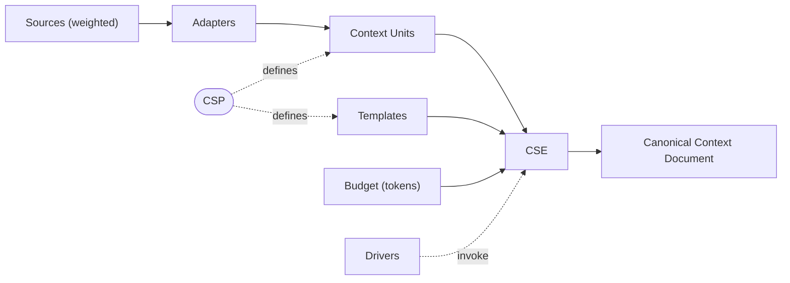

# Vision Diagram

```mermaid
graph LR
    S["Sources (weighted)"] --> A["Adapters"]
    A --> CU["Context Units"]

    CSP(["CSP"]) -. defines .-> CU
    CSP -. defines .-> T["Templates"]

    CU --> CSE["CSE"]
    T --> CSE
    B["Budget (tokens)"] --> CSE

    CSE --> CCD["Canonical Context Document"]

    D["Drivers"] -. invoke .-> CSE
```
